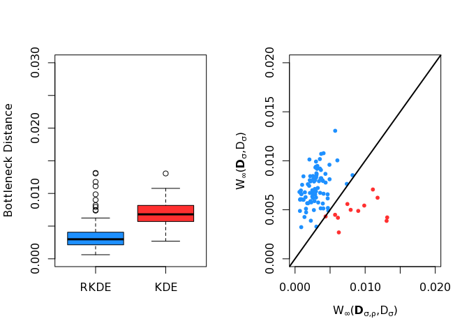
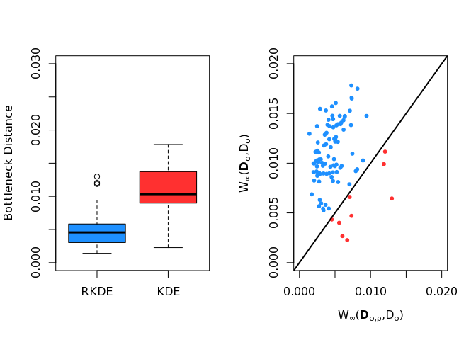
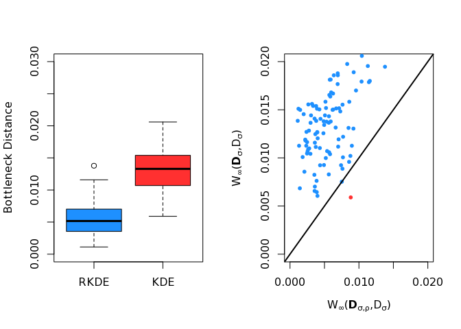
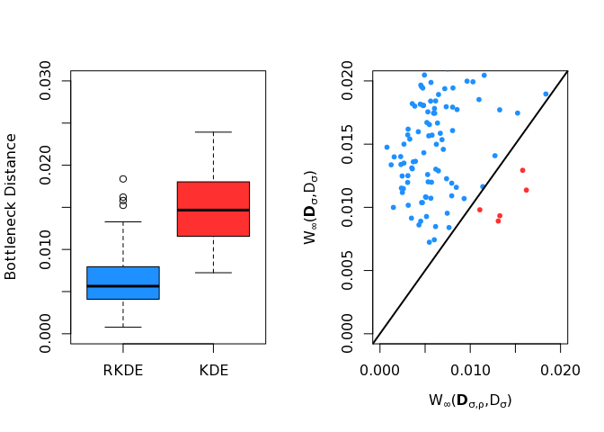
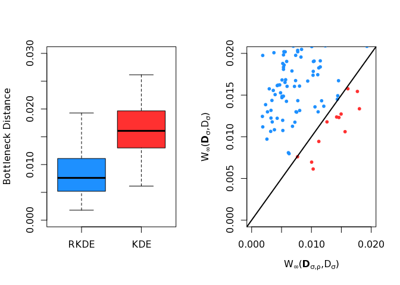

Bottleneck Simulation Experiment
--------------------------------

Set-up the parameters for the simulation.

``` r
root <- "/path/to/root/directory/"
setwd(root)
source("./RKDE.R")
source("./ph-functions.R")
source("./bottleneck/bottleneck-functions.R")

# Set up cores for simulation in parallel

nprocs <- 1   # Change this value if you can use more processors
mp_type = "PSOCK"
cl <- parallel::makeCluster(nprocs, type=mp_type)
doParallel::registerDoParallel(cl)


# Main Code

p <- (c(1:5)/10)*2
n <- 100

set.seed(2020)
a <- list()

for(k in 1:length(p)){
  a[[k]] <- foreach(i=1:n,.combine='rbind',
                    .packages = packages) %dopar% {
                      source("./RKDE.R", local = TRUE)
                      source("./ph-functions.R", local = TRUE)
                      
                      Z <- simulate_data(n=200, p = p[k] , plt=F)
                      X <- Z[[1]]
                      Y <- Z[[2]]
                      
                      H <- bw(X,5)
                      by <- 0.1
                      
                      DiagGrid_kde <- ph.kde(X,by,H)
                      DiagGrid_true <- ph.kde(Y,by,H)
                      DiagGrid_rkde <- ph.rkde2(X,by,H)
                      
                      
                      d.rk.true <- bottleneck(DiagGrid_rkde[['diagram']],
                                              DiagGrid_true[['diagram']])
                      
                      d.kd.true <- bottleneck(DiagGrid_kde[['diagram']],
                                              DiagGrid_true[['diagram']])
                      
                      d.diff <- d.rk.true-d.kd.true
                      c(d.rk.true,d.kd.true,d.diff)
                    }
}
```

Final results.

``` r
cols <- c('firebrick1','dodgerblue')

for(i in 1:5){
  df <- a[[i]]
  RKDE <- df[,1]
  KDE <- df[,2]
  par(mfrow=c(1,2))
  boxplot(RKDE,KDE,col=cols[c(2,1)],ylim=c(0,0.03),
          names = c('RKDE','KDE'),ylab="Bottleneck Distance")
  
  ids.1 <- which(df[,3]>0)
  ids.2 <- which(df[,3]<0)
  ids.3 <- which(df[,3]==0)
  plot(df[ids.1,1],df[ids.1,2],xlim=c(0,0.02),ylim=c(0,0.02),col=cols[1],pch=20,
       ylab=TeX('$W_{\\infty}(\\mathbf{D}_{\\sigma},D_{\\sigma})$'),
       xlab=TeX('$W_{\\infty}(\\mathbf{D}_{\\sigma,\\rho},D_{\\sigma})$')
  )
  points(df[ids.2,1],df[ids.2,2],xlim=c(0,0.02),ylim=c(0,0.02),col=cols[2],pch=20)
  
  if(length(ids.3)!=0){
    points(df[ids.3,1],df[ids.3,2],xlim=c(0,0.02),ylim=c(0,0.02),col='green',pch=20)
  }
  abline(a=0,b=1,lwd=2)
}
```


