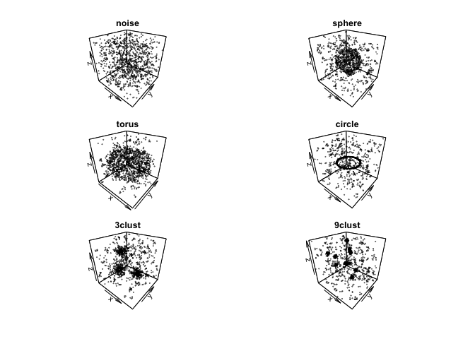
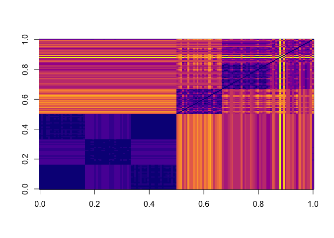
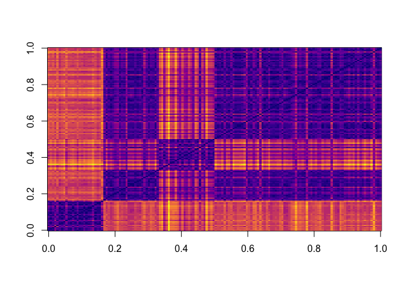

## Spectral Clustering using Persitent Homology

Load the necessary data. `X.RData` contains 150 three-dimensional point
clouds from 6 different classes. `cls.RData` contains the class
information. The pre-trained persistence diagram from the distance
function, and the robust persistence diagrams are stored in
`dist-dgms.RData` and `rkde-dgms.RData`.

``` r
## Preliminaries
root <- "/path/to/root/directory/"
setwd(root)

source('./RKDE.R')
source('./ph-functions.R')
source('./Clustering/spectral-functions.R')

## Load the pre-trained Data
load('./Clustering/data/X.RData')         # Point clouds
load('./Clustering/data/cls.RData')       # Corresponding class
load('./Clustering/data/dist-dgms.RData') # Dgm from distance function
load('./Clustering/data/rkde-dgms.RData') # Robust persistence Dgm

ad <- lapply(dist.dgms,function(x)x$diagram)
rd <- lapply(rkde.dgms,function(x)x$diagram)
```

Some sample plots:

``` r
set.seed(1)
idx <- sample(1:25,6,replace = F) + seq(0,125,by=25)
par(mfrow=c(3,2),oma=c(2,2,2,2),mar=c(1,1,1,1))
sapply(idx,function(i){
    P <- X[[i]]
    scatter3D(P[,1],P[,2],P[,3],col=alpha("black",0.5), pch=20, main=cls[[i]],phi = 30, cex=0.3)
    return(T)})
```

<!-- -->

Compute the distance matrices:

``` r
Delta.imgs <- pimg.dist.matrix(ad)
Delta.dgms <- dgm.dist.matrix(rd)
```

Some sample images for the pairwise distance matrix:

(1). H0, Winf for Persistence Image

``` r
Delta.dgms[[1]][[1]] %>% image(col=viridis(20,option = 'C'))
```

<!-- -->

(2). H0, Winf for Persistence Image

``` r
Delta.imgs[[1]][[1]] %>% image(col=viridis(20,option = 'C'))
```

<!-- -->

The results from spectral clustering:

``` r
numclasses <- c(1:6)
names(numclasses) <- c('noise','sphere','torus','circle','3clust','9clust')

n <- 100

set.seed(2020)
scc <- clust_rand_index(n,cls,numclasses,Delta.dgms, Delta.imgs)
scc$summary
```

    ##           W1        W2      Winf        W1        W2      Winf
    ## H0 0.9530201 0.9365548 0.9444295 0.7853244 0.8177181 0.7795973
    ## H1 0.9143624 0.8856376 0.8453691 0.8189709 0.8114541 0.7775391
    ## H2 0.8671141 0.7369128 0.7387919 0.8009843 0.7712752 0.7735123
    ## C  0.9572260 0.9365548 0.9444295 0.8243400 0.7880089 0.7978523
