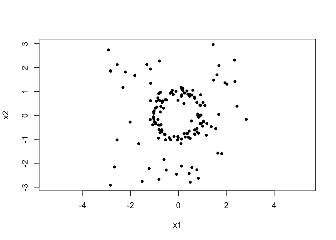
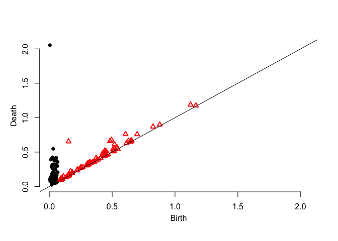
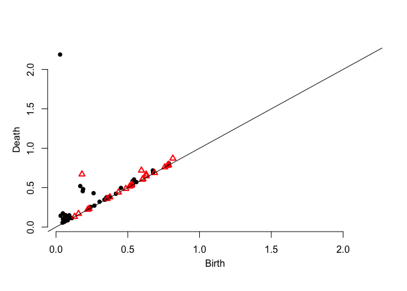
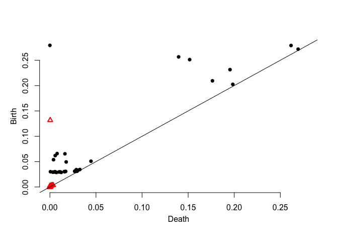
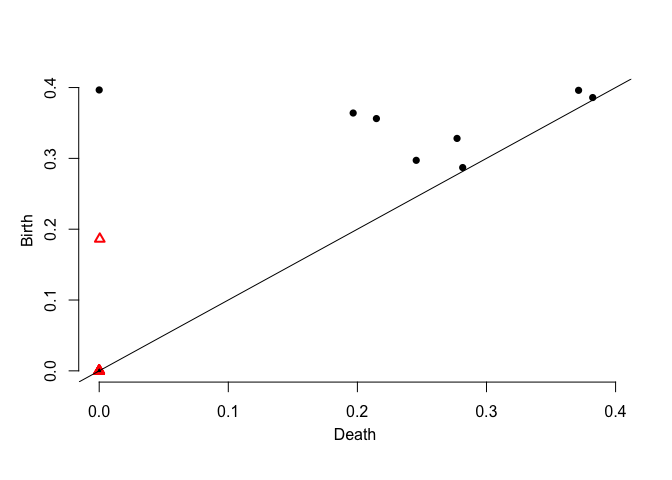

Introduction
------------

This page describes the method to construct robust persistence diagrams, as implemented in our paper [Robust Persistence Diagrams using Reproducing Kernels](https://arxiv.org/abs/2006.10012). 

You will need the following dependencies for implementing the analyses using R. Please run the following code:

``` r
pkgs <- c("dplyr","plotrix","spatstat","TDA","hitandrun","functional","Rfast","plotly","viridis","plot3D")
sapply(pkgs, install.packages, character.only=TRUE)
```

Here’s an example for computing the persistence diagrams
=============================

We start by sampling points $\mathbb{X}_n$ from a circle in $\mathbb{R}^2$ with some uniform noise in the enclosing region. 

``` r
set.seed(2020)
signal <- circleUnif(100,r=1)*rnorm(100,1,0.1)
noise  <- matrix(runif(50*2,-3,3),ncol=2)
X <- rbind(signal,noise)
plot(X,asp=1,pch=20)
```



Here are the persistence diagrams.

1.  Distance Function Persistence Diagram

``` r
dgm.distFct <- ph.distfun(X,by=0.1,H=0)$diagram
plot(dgm.distFct)
```



1.  DTM Persistence Diagram

``` r
dgm.dtm <- ph.dtm(X,by=0.1,m0 = M0(X,3))$diagram
plot(dgm.dtm)
```



1.  KDE Persistence Diagram

``` r
dgm.kde <- ph.kde(X,by=0.1,H=bw(X,3))$diagram
plot(dgm.kde)
```



1.  Robust Persistence Diagram

``` r
dgm.rkde <- ph.rkde2(X,by=0.1,H=bw(X,3))$diagram
plot(dgm.rkde)
```


