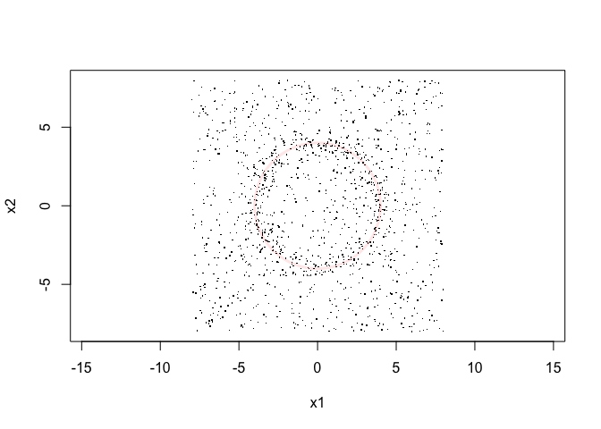
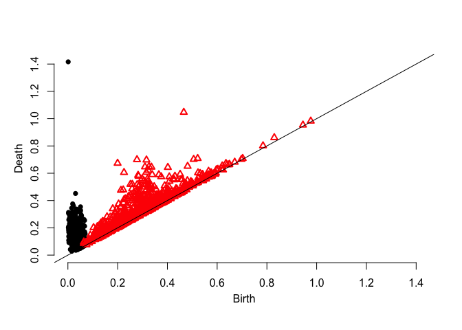
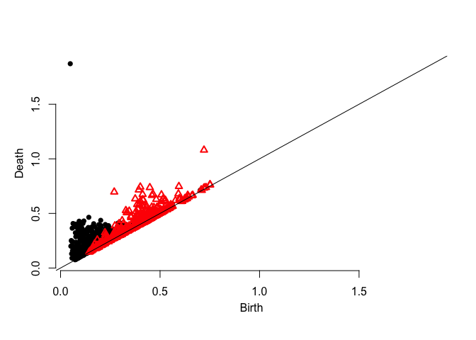
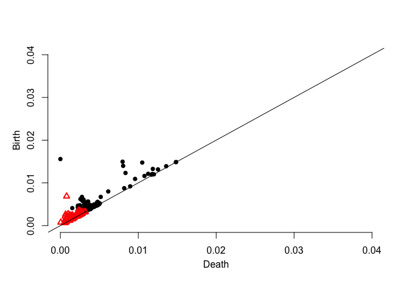
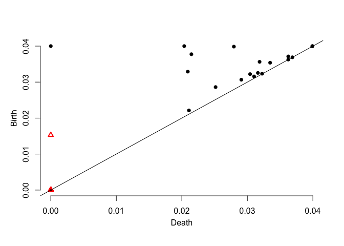

This page describes the method to construct robust persistence diagrams,
as implemented in our paper [Robust Persistence Diagrams using
Reproducing Kernels](https://arxiv.org/abs/2006.10012).

You will need the following dependencies for implementing the analyses
using R. Please run the following code:

``` r
pkgs <- c("dplyr","plotrix","spatstat","TDA","hitandrun","functional","Rfast","plotly","viridis","plot3D")
sapply(pkgs, install.packages, character.only=TRUE)
```

## Here’s an example for computing the persistence diagrams

We start by sampling points \(\mathbb{X}_n\) from a circle in 2D with
some uniform noise in the enclosing region.

``` r
set.seed(2020)
signal <- circleUnif(400,4)*rnorm(400,1,0.1)
noise <- matrix(runif(2*1000,-8,8),ncol=2)
X <- rbind(signal,noise)
plot(X,asp=1,pch='.')
draw.circle(0,0,4,border = alpha('red',0.1),lwd=3)
```

<!-- -->

Here are the persistence diagrams.

### 1\. Distance Function Persistence Diagram

``` r
dgm.distFct <- ph.distfun(X,by=0.1,H=0)$diagram
plot.diagram(dgm.distFct)
```

<!-- -->

### 2\. DTM Persistence Diagram

``` r
dgm.dtm <- ph.dtm(X,by=0.1,m0 = M0(X,3))$diagram
plot.diagram(dgm.dtm)
```

<!-- -->

### 3\. KDE Persistence Diagram

``` r
dgm.kde <- ph.kde(X,by=0.1,H=bw(X,3))$diagram
plot.diagram(dgm.kde)
```

    ## # Generated complex of size: 184451 
    ## 
    ## 0%   10   20   30   40   50   60   70   80   90   100%
    ## |----|----|----|----|----|----|----|----|----|----|
    ## ***************************************************
    ## # Persistence timer: Elapsed time [ 0.511744 ] seconds

<!-- -->

### 4\. Robust Persistence Diagram

``` r
dgm.rkde <- ph.rkde2(X,by=0.1,H=bw(X,3))$diagram
plot.diagram(dgm.rkde)
```

    ## # Generated complex of size: 184451 
    ## 
    ## 0%   10   20   30   40   50   60   70   80   90   100%
    ## |----|----|----|----|----|----|----|----|----|----|
    ## ***************************************************
    ## # Persistence timer: Elapsed time [ 0.634449 ] seconds

<!-- -->
